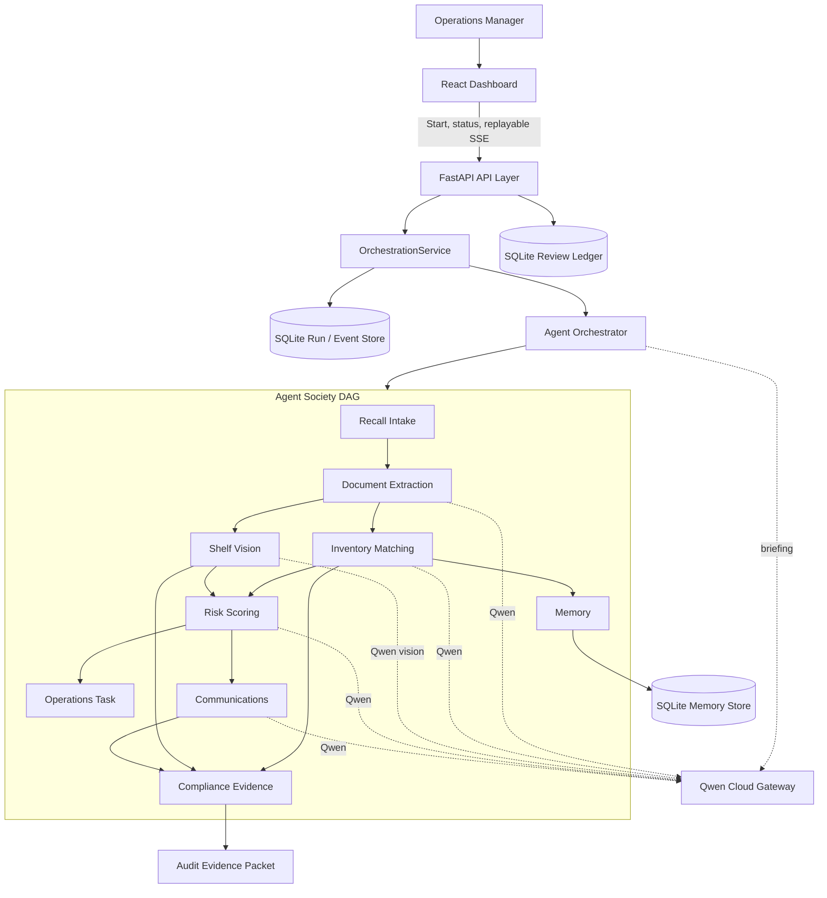

# BatchHelm AI Architecture

## System Overview

BatchHelm is a modular web application: a React dashboard, a FastAPI backend, a
Qwen gateway, a real agent-orchestration layer, a deterministic workflow core,
and a durable persistence layer. The orchestrator runs nine specialist agents
as a dependency graph (DAG) with parallel waves, retries, typed wave
checkpoints, and replayable event streaming.

## Services

### React Dashboard

Responsibilities:

- display active recall incidents
- visualize agent progress
- collect uploads and shelf photos
- show affected inventory decisions
- manage staff tasks
- preview notices and evidence packets

### FastAPI API Layer

Responsibilities:

- validate requests and uploads
- expose incident, task, memory, and packet endpoints
- coordinate workflow jobs
- provide structured error responses
- emit structured logs

### Orchestration Service

`OrchestrationService` owns the lifecycle around the DAG:

- idempotently creates one run per request UUID
- guarantees one in-process worker per run
- persists each event before waking SSE subscribers
- replays ordered events from `Last-Event-ID` or `after`
- stores a typed blackboard snapshot after every completed wave
- recovers non-terminal runs from the latest snapshot at API startup
- persists terminal results and sanitized failure states

### Qwen Gateway

Responsibilities:

- isolate model-provider configuration
- call Qwen text and vision models
- request structured JSON outputs
- normalize provider errors
- record latency, model, and token metadata where available

### Agent Orchestrator

The orchestrator (`agents/orchestrator.py`) layers agents into topological waves,
runs each wave with `asyncio.gather` (genuine parallelism), wraps every agent
with timing, bounded retries, and failure isolation (a failed agent skips its
dependents instead of crashing the run), reconciles disagreement between Qwen
and the authoritative inventory, and assembles the final analysis plus a
management briefing. Each completed wave produces a typed snapshot, and every
agent step produces an `AgentRunEvent`.

Specialist agents (`agents/`), each tagged with its output source
(`qwen` / `deterministic` / `memory`):

- **Recall Intake Agent** — validates and normalizes the incoming notice
- **Document Extraction Agent** — Qwen extracts structured recall criteria
- **Inventory Matching Agent** — matches inventory, resolves supplier aliases (Qwen reasoning)
- **Shelf Vision Agent** — Qwen vision reads shelf/stockroom photos
- **Risk Scoring Agent** — Qwen classifies risk and response priority
- **Operations Task Agent** — generates removal/quarantine/disposal/notice tasks
- **Communications Agent** — Qwen drafts the customer notice
- **Compliance Evidence Agent** — assembles the audit-ready evidence checklist
- **Memory Agent** — persists aliases/decisions/false positives and surfaces insights

### Workflow Engine

Responsibilities:

- maintain incident state
- enforce required steps before resolution
- merge agent outputs into canonical decisions
- track confidence and human review requirements
- create audit events for every decision

### Persistence

Local storage is separated by responsibility:

- `SQLiteOrchestrationRepository` stores runs, ordered events, wave snapshots,
  terminal results, and failures in WAL mode.
- `SQLiteMemoryRepository` stores supplier aliases, decisions, and false
  positives learned by the Memory Agent.
- `SQLiteReviewRepository` stores immutable human-review decisions.
- the filesystem upload directory stores accepted shelf images.

Evidence-packet content is versioned with canonical SHA-256 data that excludes
generation timestamps. Reviewer decisions are folded chronologically to
reconstruct current readiness and the complete audit trail. Repository
boundaries allow future shared-database adapters without changing the services
or HTTP contracts.

## Data Flow

1. The dashboard sends a request UUID to `POST /api/incidents/demo/runs` and
   receives one canonical run ID.
2. It subscribes to `GET /api/orchestration/runs/{run_id}/events`; persisted
   events after the requested sequence are replayed before live events.
3. The service claims one worker and the orchestrator runs the DAG in waves;
   intake and extraction first,
   then inventory matching and vision in parallel, then risk and memory, then
   operations and communications, then compliance.
4. Qwen-driven agents call the gateway and validate output against Pydantic
   schemas, falling back deterministically on any failure.
5. Each event is committed before publication. After a wave completes, its
   typed blackboard and agent results are saved as the next restart boundary.
6. The Memory Agent persists aliases/decisions and surfaces insights from prior runs.
7. The orchestrator reconciles Qwen vs. inventory ground truth and assembles the
   canonical `RecallAnalysis` plus a management briefing.
8. The terminal result is persisted, returned by the status endpoint, and sent
   as the final SSE frame.
9. The evidence builder produces a versioned, downloadable audit packet, gated by
   a durable human review decision.

On API restart, the service lists pending or running records, loads each latest
checkpoint, and resumes from `next_wave`; completed waves are not re-executed.
This recovery scope is single-process. Multi-replica execution requires a
distributed claim or lease mechanism and shared database.

## Error Handling

- Upload validation rejects unsupported files with actionable messages.
- Model-provider errors return retryable or non-retryable categories.
- Low-confidence model outputs require human review.
- Workflow state prevents incidents from being marked resolved while required tasks remain open.
- Every model-derived claim is tied to source evidence when possible.
- Conflicting idempotency keys return HTTP 409 without duplicating audit events.
- Missing runs return HTTP 404 and malformed replay cursors return HTTP 400.
- Orchestration or review storage failures return sanitized HTTP 503 responses
  without filesystem or database details.

## Security And Privacy

- API keys are loaded from environment variables only.
- Uploaded documents remain local in the MVP unless deployment storage is configured.
- Logs avoid raw document contents and customer personal data.
- The app uses role-ready boundaries even if the MVP ships with a single demo user.
- Generated notices are drafts and require user approval before external use.

## Testing Strategy

- Unit tests for parsers, match scoring, workflow transitions, and packet building
- Contract tests for API endpoints
- Provider tests with mocked Qwen responses
- Vitest reducer and hook tests for replay deduplication, refresh reuse, and rerun
- Manual browser verification at desktop and mobile widths
- Automated Playwright end-to-end coverage is planned but not implemented

## Deployment Direction

The production deployment path will use Docker and Alibaba Cloud:

- containerized FastAPI backend
- static frontend build served by the backend or object storage/CDN
- environment-managed Qwen credentials
- persistent volume or object storage for uploaded files
- managed database option for Postgres-compatible deployment

The current SQLite worker model must run as one API replica. ACK horizontal
scaling is a future deployment mode after shared persistence and distributed
worker ownership are implemented.
