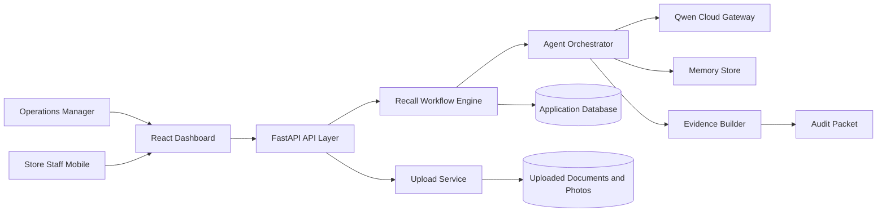

# BatchHelm AI Architecture

## System Overview

BatchHelm is organized as a modular web application with a React dashboard, FastAPI backend, Qwen model gateway, agent orchestration layer, workflow engine, and persistence layer.

## Services

### React Dashboard

Responsibilities:

- display active recall incidents
- visualize agent progress
- collect uploads and shelf photos
- show affected inventory decisions
- manage staff tasks
- preview notices and evidence packets

### FastAPI API Layer

Responsibilities:

- validate requests and uploads
- expose incident, task, memory, and packet endpoints
- coordinate workflow jobs
- provide structured error responses
- emit structured logs

### Qwen Gateway

Responsibilities:

- isolate model-provider configuration
- call Qwen text and vision models
- request structured JSON outputs
- normalize provider errors
- record latency, model, and token metadata where available

### Agent Orchestrator

Specialist agents:

- Recall Intake Agent: extracts affected product criteria from notices
- Inventory Match Agent: matches invoices, inventory, and catalog rows
- Vision Inspector Agent: reads shelf and stockroom photos
- Ops Coordinator Agent: creates staff tasks and escalation rules
- Customer Comms Agent: drafts customer and supplier notices
- Compliance Packet Agent: compiles evidence and unresolved risks
- Memory Agent: learns aliases, layouts, and previous decisions

### Workflow Engine

Responsibilities:

- maintain incident state
- enforce required steps before resolution
- merge agent outputs into canonical decisions
- track confidence and human review requirements
- create audit events for every decision

### Persistence

Local demo storage starts with SQLite and filesystem uploads. The repository layer will avoid SQLite-specific assumptions so the deployment can move to Postgres or Alibaba Cloud database services.

## Data Flow

1. User creates a recall incident or selects a sample incident.
2. User uploads notice, invoice CSV/PDF, inventory CSV, and shelf photos.
3. API stores files and creates audit events.
4. Workflow engine invokes intake, matching, vision, and ops agents.
5. Agents call Qwen through the gateway and return typed outputs.
6. Workflow engine computes affected inventory decisions.
7. Dashboard updates incident timeline, task board, and risk summary.
8. Evidence builder generates a packet preview and downloadable report.

## Error Handling

- Upload validation rejects unsupported files with actionable messages.
- Model-provider errors return retryable or non-retryable categories.
- Low-confidence model outputs require human review.
- Workflow state prevents incidents from being marked resolved while required tasks remain open.
- Every model-derived claim is tied to source evidence when possible.

## Security And Privacy

- API keys are loaded from environment variables only.
- Uploaded documents remain local in the MVP unless deployment storage is configured.
- Logs avoid raw document contents and customer personal data.
- The app uses role-ready boundaries even if the MVP ships with a single demo user.
- Generated notices are drafts and require user approval before external use.

## Testing Strategy

- Unit tests for parsers, match scoring, workflow transitions, and packet building
- Contract tests for API endpoints
- Provider tests with mocked Qwen responses
- UI component tests for dashboard state transitions
- End-to-end demo test using the sample recall dataset

## Deployment Direction

The production deployment path will use Docker and Alibaba Cloud:

- containerized FastAPI backend
- static frontend build served by the backend or object storage/CDN
- environment-managed Qwen credentials
- persistent volume or object storage for uploaded files
- managed database option for Postgres-compatible deployment
