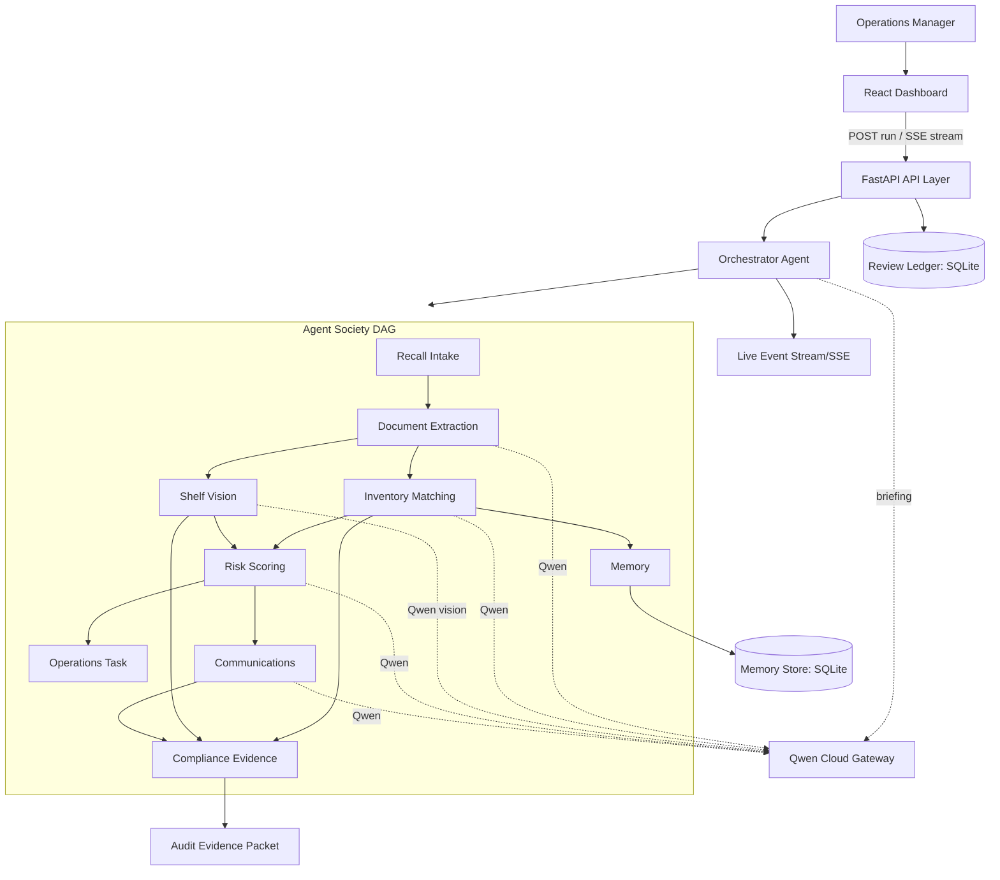

# BatchHelm AI Architecture

## System Overview

BatchHelm is a modular web application: a React dashboard, a FastAPI backend, a
Qwen gateway, a real agent-orchestration layer, a deterministic workflow core,
and a durable persistence layer. The orchestrator runs nine specialist agents as
a dependency graph (DAG) with parallel waves, retries, checkpoints, and live
event streaming.

## Services

### React Dashboard

Responsibilities:

- display active recall incidents
- visualize agent progress
- collect uploads and shelf photos
- show affected inventory decisions
- manage staff tasks
- preview notices and evidence packets

### FastAPI API Layer

Responsibilities:

- validate requests and uploads
- expose incident, task, memory, and packet endpoints
- coordinate workflow jobs
- provide structured error responses
- emit structured logs

### Qwen Gateway

Responsibilities:

- isolate model-provider configuration
- call Qwen text and vision models
- request structured JSON outputs
- normalize provider errors
- record latency, model, and token metadata where available

### Agent Orchestrator

The orchestrator (`agents/orchestrator.py`) layers agents into topological waves,
runs each wave with `asyncio.gather` (genuine parallelism), wraps every agent
with timing, bounded retries, and failure isolation (a failed agent skips its
dependents instead of crashing the run), persists a per-agent checkpoint to
memory, reconciles disagreement between Qwen and the authoritative inventory,
and assembles the final analysis plus an AI Showrunner briefing. Every step
emits a live `AgentRunEvent` over SSE.

Specialist agents (`agents/`), each tagged with its output source
(`qwen` / `deterministic` / `memory`):

- **Recall Intake Agent** — validates and normalizes the incoming notice
- **Document Extraction Agent** — Qwen extracts structured recall criteria
- **Inventory Matching Agent** — matches inventory, resolves supplier aliases (Qwen reasoning)
- **Shelf Vision Agent** — Qwen vision reads shelf/stockroom photos
- **Risk Scoring Agent** — Qwen classifies risk and response priority
- **Operations Task Agent** — generates removal/quarantine/disposal/notice tasks
- **Communications Agent** — Qwen drafts the customer notice
- **Compliance Evidence Agent** — assembles the audit-ready evidence checklist
- **Memory Agent** — persists aliases/decisions/false positives and surfaces insights

### Workflow Engine

Responsibilities:

- maintain incident state
- enforce required steps before resolution
- merge agent outputs into canonical decisions
- track confidence and human review requirements
- create audit events for every decision

### Persistence

Local demo storage uses filesystem uploads and `SQLiteReviewRepository` behind
the typed `ReviewRepository` application boundary. Evidence-packet content is
versioned with canonical SHA-256 data that excludes generation timestamps.
Reviewer decisions are immutable ledger rows and are folded chronologically to
reconstruct current readiness and the complete audit trail. A Postgres adapter
can implement the same protocol without changing the review service or API.
SQLite schema v2 preserves the packet's original audit timestamp and migrates
existing v1 review rows in place.

## Data Flow

1. The dashboard calls `POST /api/incidents/demo/run` (or opens the SSE stream).
2. The orchestrator runs the agent DAG in waves; intake and extraction first,
   then inventory matching and vision in parallel, then risk and memory, then
   operations and communications, then compliance.
3. Qwen-driven agents call the gateway and validate output against Pydantic
   schemas, falling back deterministically on any failure.
4. The Memory Agent persists aliases/decisions and surfaces insights from prior runs.
5. The orchestrator reconciles Qwen vs. inventory ground truth and assembles the
   canonical `RecallAnalysis` plus a management briefing.
6. Live `AgentRunEvent`s stream to the dashboard mission-control panel.
7. The evidence builder produces a versioned, downloadable audit packet, gated by
   a durable human review decision.

## Error Handling

- Upload validation rejects unsupported files with actionable messages.
- Model-provider errors return retryable or non-retryable categories.
- Low-confidence model outputs require human review.
- Workflow state prevents incidents from being marked resolved while required tasks remain open.
- Every model-derived claim is tied to source evidence when possible.
- Conflicting idempotency keys return HTTP 409 without duplicating audit events.
- Review storage failures return sanitized HTTP 503 responses without database details.

## Security And Privacy

- API keys are loaded from environment variables only.
- Uploaded documents remain local in the MVP unless deployment storage is configured.
- Logs avoid raw document contents and customer personal data.
- The app uses role-ready boundaries even if the MVP ships with a single demo user.
- Generated notices are drafts and require user approval before external use.

## Testing Strategy

- Unit tests for parsers, match scoring, workflow transitions, and packet building
- Contract tests for API endpoints
- Provider tests with mocked Qwen responses
- UI component tests for dashboard state transitions
- End-to-end demo test using the sample recall dataset

## Deployment Direction

The production deployment path will use Docker and Alibaba Cloud:

- containerized FastAPI backend
- static frontend build served by the backend or object storage/CDN
- environment-managed Qwen credentials
- persistent volume or object storage for uploaded files
- managed database option for Postgres-compatible deployment
